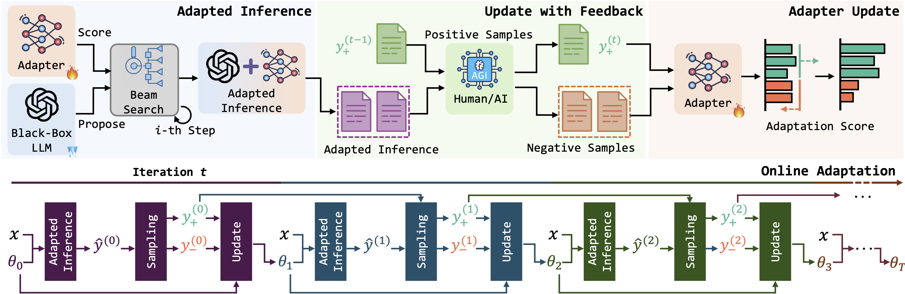

# BBox-Adapter

This repository extends the BBox-Adapter framework with Adaptive-Weighted NCE, improving model robustness against various input perturbations. This implementation shows improved resilience to temperature variations, typos, and noise injection while maintaining the lightweight nature of the original adapter.

## Table of Contents
- [Improvements to Original Work](#improvements-to-original-work)
  - [Core Improvements](#core-improvements)
  - [Implementation Enhancements](#implementation-enhancements)
- [Experimental Results and Analysis](#experimental-results-and-analysis)
  - [Usage Examples](#usage-examples)
  - [Robustness Evaluation Results](#robustness-evaluation-results-on-a-subeset-of-strategyqa)
    - [Overall Robustness Scores](#overall-robustness-scores)
    - [Accuracy Drop Analysis](#accuracy-drop-analysis)
  - [Key Observations](#key-observations)
  - [Robustness Calculation](#robustness-calculation)
  - [Limitations](#limitations)
  - [Conclusion](#conclusion)
  - [Future Work](#future-work)
- [Original Paper (BBox-Adapter)](#original-paper-bbox-adapter)
  - [Project links](#project-links)
  - [Overview of BBOX-ADAPTER for Black-Box LLM Adaption](#overview-of-bbox-adapter-for-black-box-llm-adaption)
  - [Citation](#citation)

## Improvements to Original Work

### Core Improvements
- **Adaptive-Weighted NCE:** Adaptive NCE dynamically adjusts the importance of negative samples during training based on their difficulty level, helping the model focus on more challenging examples.
  - Loss calculation:
    1. Model computes energy scores for positive and negative samples.
    2. Normalization - Negative energy values are normalized to prevent numerical instability and sigmoid saturation.
    3. Hardness Computation - Sample hardness is determined using sigmoid on the normalized energy values.
    4. Weight Assignment - Non-linear scaling is applied to hardness scores to give more emphasis to harder examples.
    5. Loss Calculation - Final loss is computed as the difference between mean positive energy and weighted mean negative energy.
  - Configuration
    - `use_adaptive_nce`: Enables/disables adaptive NCE
    - `energy_scaling_factor`: Controls sensitivity to energy differences
    - `min_energy_weight`: Lower bound for negative sample weights
    - `max_energy_weight`: Upper bound for negative sample weights

### Implementation Enhancements
- **Robustness Evaluation:**
  - Added robustness testing for model stability against:
    - Temperature variations
    - Typo injections
    - Paraphrasing
    - Noise
  - Configure via `eval_robustness` and related parameters in config. See [strategyqa.yaml](configs/strategyqa.yaml) for reference.
  - More details in [Robustness Calculation](#robustness-calculation) section.

- **Extended LLM API Support:** 
  - Added Groq API integration to support non-OpenAI models like LLaMA, Mixtral, etc.
    - Set `generator_provider` as `groq` or `openai` in config.
    - Set `generator_model` to the desired model. Example: `mixtral-8x7b-32768` or `llama-3.1-8b-instant`. 
    - Set `generator_api_key_name` to the environment variable containing your API key. For example, `OPENAI_API_KEY` or `GROQ_API_KEY`.  

- **Memory Optimization during training:**
  - Added gradient checkpointing to reduce memory footprint during training to allow training on machines with low specs. Enable via `use_gradient_checkpointing` in config.

- **Bug Fixes:**
  - Fixed warmup epoch validation to properly handle disabled warmup configurations - prevents config errors by checking `use_blackbox_warmup` before accessing `num_epochs_blackbox_warmup`

## Experimental Results and Analysis

### Usage Examples
```yaml
# Example config for adaptive NCE
use_adaptive_nce: True
energy_scaling_factor: 0.5
min_energy_weight: 1.0
max_energy_weight: 5.0
```

### Robustness Evaluation Results (on a subeset of StrategyQA)

#### Overall Robustness Scores
| Robustness Test | Standard NCE | Adaptive-Weighted NCE | Improvement |
|-----------------|--------------|----------------------|-------------|
| Temperature     | 0.9758       | 0.9799              | +0.0041     |
| Typos          | 0.9429       | 1.0000              | +0.0571     |
| Paraphrase     | 0.7429       | 0.6765              | -0.0664     |
| Noise          | 0.6571       | 0.7059              | +0.0488     |
| Overall        | 0.8297       | 0.8406              | +0.0109     |

#### Accuracy Drop Analysis
| Perturbation Type | Standard NCE | Adaptive-Weighted NCE | Improvement |
|-------------------|--------------|----------------------|-------------|
| Temperature      | -2.90%      | -1.45%              | +1.45%      |
| Typos            | -4.35%      | +2.17%              | +6.52%      |
| Paraphrase       | -19.57%     | -23.91%             | -4.34%      |
| Noise            | -26.09%     | -21.74%             | +4.35%      |

Note: Negative values indicate performance degradation, positive values indicate improvement.

This implementation is good at handling minor perturbations while maintaining performance on more substantial variations.

### Key Observations
- **Temperature Stability:** Adaptive-Weighted NCE significantly reduced accuracy degradation under different temperature settings, showing more consistent performance.
- **Typo Handling:** Good robustness score on typographical variations shows resilience to input noise.
- **Noise Resistance:** 4.88% improvement in noise robustness testing indicates better handling of random perturbations.
- **Paraphrase Challenge:** Slight decrease in paraphrase robustness suggests room for improvement in handling semantic variations. This could also be due to the way we are applying the paraphrasing transform, which is an oversimplified approach and may not always produce coherent paraphrases.

### Robustness Calculation
The robustness score for each perturbation type is calculated considering:
1. **Performance Degradation:** Relative performance compared to base accuracy
2. **Consistency:** For temperature variations, additional consideration of performance stability across different settings

Robustness Score for standard perturbations = degradation_score  
Robustness Score for temperature: 0.5 * consistency_score + 0.5 * degradation_score

where:
- degradation_score = average_perturbed_accuracy / base_accuracy
- consistency_score = 1 - standard_deviation(accuracies) [only for temperature variations]

### Limitations
1. **Dataset Coverage:** Current experiments were conducted on 10% of the StrategyQA dataset due to resource constraints.
2. **Task Specificity:** Testing was limited to the StrategyQA task. Needs validation on other tasks.
3. **Parameter Sensitivity:** Current parameters may need adjustment for different tasks or larger datasets.

### Conclusion
The introduction of Adaptive-Weighted NCE shows promising improvements in model robustness, particularly for handling input variations and noise.

### Future Work
1. **Full Dataset Validation:** Extend experiments to the complete StrategyQA dataset.
2. **Task Generalization:** Test the approach on different reasoning tasks and datasets.
3. **Paraphrase Handling:** Investigate methods to improve robustness against semantic variations.

## Original Paper (BBox-Adapter)

### Project links

[arXiv] [BBox-Adapter: Lightweight Adapting for Black-Box Large Language Models](https://arxiv.org/abs/2402.08219) \
[Website] [BBox-Adapter Project](https://haotiansun14.github.io/BBox-Adapter-page/)

### Overview of BBOX-ADAPTER for Black-Box LLM Adaption



### Citation

```bibtex
@misc{sun2024bboxadapter,
      title={BBox-Adapter: Lightweight Adapting for Black-Box Large Language Models}, 
      author={Haotian Sun and Yuchen Zhuang and Wei Wei and Chao Zhang and Bo Dai},
      year={2024},
      eprint={2402.08219},
      archivePrefix={arXiv},
      primaryClass={cs.CL}
}
```
